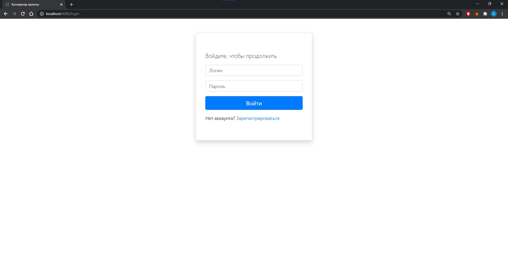
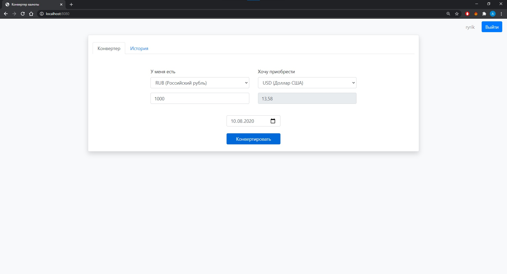
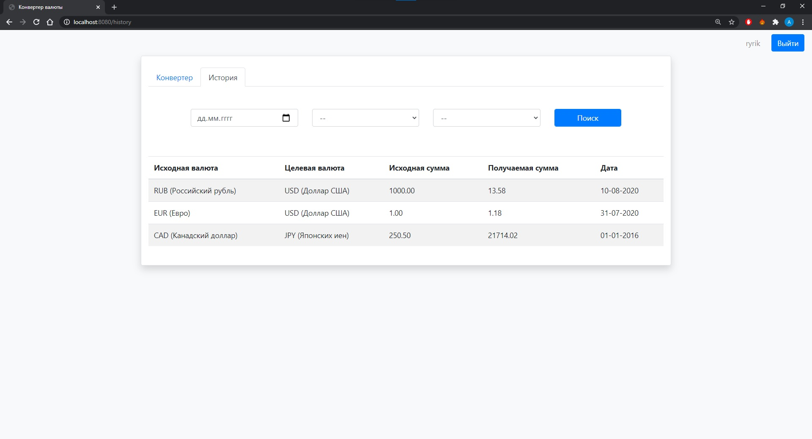

# Currency Converter

An application for converting currencies at exchange rate from the Central Bank. It uses PostgreSQL to store currencies rates and history of user's conversions.

To perform any actions a user has to be registered and then authorized.

## Running the application
To run the application change database properties in application.properties (url, username, password). By default, it runs on the port `8080`.

- Building app

```
./mvnw clean install
```

- Running app
```
java -jar target/currency-converter-0.0.1-SNAPSHOT.jar
```

## Interface examples






